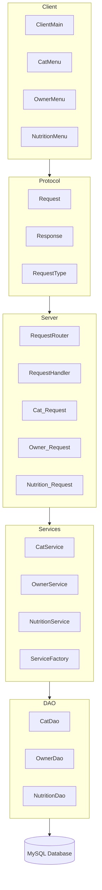

# 2025-26 - OOP - L8 - GCA2 — N-tier System

## 1. Project Overview

### Domain summary (150–200 words)
This project is a cat management system built for veterinary clinics or pet care services. The system stores information about cats, owners, and nutrition plans in a MySQL database.
Users can create, update, search, and delete records through a client-server application. Each cat belongs to an owner, and nutrition records are linked to a specific cat.
The project also supports image upload and retrieval. Cat and owner profile photos are converted to Base64 on the client, stored as BLOB data in MySQL, and reconstructed back into image files when downloaded.
The application uses JDBC, sockets, JSON communication, and a multithreaded server.

### Team
- **Group ID:** `2025-26-L8-OOP-GCA2-SD2A_3`
- **Members:**
    - Student A — `D00278140`
    - Student B — `D00284885`
    - Student C — `D00282723`

### Key features
- JDBC DAO layer with full CRUD for Cat, Owner, and Nutrition entities
- Client-server JSON requests and responses using Request and Response<T> classes
- Multithreaded server using ExecutorService (cached thread pool)
- Binary file upload and retrieval for cat and owner profile photos stored in the database as BLOB data
- Request routing using lambdas and a HashMap
- JUnit 5 test suite with ≥70% line coverage evidence

---

## 2. How to Run

### Prerequisites
- Java: `17+` (or the version used in labs)
- IntelliJ IDEA (recommended)
- MySQL Server - port 3306 (Windows) or 8889 (macOS via MAMP)
- Maven

### 2.1 Database setup
1. Create a database (example): `CatnOwner`
2. Run the script:
    - `sql/mysqlSetup.sql`
3. Verify seed data:
    - each table (cats, owners, nutrition) has at least 10 rows.

### 2.2 Configure credentials
Database credentials are configured in service/ServiceFactory.java. The factory auto-detects the OS:
- macOS: connects to localhost:8889/CatnOwner
- Windows: connects to localhost:3306/CatnOwner

### 2.3 Run the server
- Main class: `server.server`
- Default port: `9000`
- Expected output:
    - "Server starting on port 9000"
    - Per-client: "Accepted: <address>" and "Handling client on <thread>"

### 2.4 Run the client(s)
- Main class: `client.ClientMain`
- Connects to localhost:9000 automatically
- Navigate via the console menu: 1 Cats - 2 Owners - 3 Nutrition - 0 Exit

---

## 3. Architecture Summary

### 3.1 N-tier overview
- Client - Console UI (ClientMain, CatMenu, OwnerMenu, NutritionMenu). Serialises requests to JSON and sends over a socket via Client
- Server - server.java accepts connections, dispatches each to a ClientHandler thread
- Service layer - CatService, OwnerService, NutritionService. Handle business logic and database calls
- DAO layer - CatDao, OwnerDao, NutritionDao interfaces. JdbcCatDao, JdbcOwnerDao, JdbcNutritionDao JDBC implementations
- Database - MySQL. tables: cats, owners, nutrition

### 3.2 Architecture diagram

---

## 4. JSON Protocol Documentation

### 4.1 Envelope format
- **Request**
    - `type`: `GET_ALL_CATS`
    - `payload`: `null`

- **Response**
    - `status`: `OK`
    - `message`: `retrieved 5 cats`
    - `statusCode` : `200`
    - `data`: [ ... ]

### 4.2 Supported request types

#### Owner operations
| Request Type         | Payload                                                                               | Success `data`                                                | Failure examples    |
|:---------------------|:--------------------------------------------------------------------------------------|:--------------------------------------------------------------|:--------------------|
| `GET_ALL_OWNERS`     | -                                                                                     | List of Owner objects                                         | DB connection error |
| `GET_OWNER_BY_ID`    | `int` (owner ID)                                                                      | Owner object                                                  | ID not found = 404  |
| `CREATE_OWNER`       | Owner JSON (`firstName`, `lastName`, `age`, `address`, `phone`, `email`)              | Created Owner object                                          | Blank field = 400   |
| `UPDATE_OWNER`       | `{ "id": int, "owner": { Owner fields } }`                                            | Updated Owner object                                          | ID not found = 404  |
| `DELETE_OWNER`       | `int` (owner ID)                                                                      | HTTP 200 int                                                  | ID not found = 404  |
| `UPLOAD_OWNER_IMAGE` | `FileUploadPayload` (`id`, `fileName`, `contentType`, `fileSize`, `imageData` Base64) | Updated Owner object                                          | IO error = 500      |
| `GET_OWNER_IMAGE`    | `int` (owner ID)                                                                      | `{ id, fileName, contentType, fileSize, imageData (Base64) }` | No image = 500      |
| `GET_OWNER_METADATA` | `int` (owner ID)                                                                      | `{ id, fileName, contentType, fileSize }`                     | Not found = 500     |

#### Cat operations
| Request Type        | Payload                                                                                                                | Success `data`                              | Failure examples      |
|:--------------------|:-----------------------------------------------------------------------------------------------------------------------|:--------------------------------------------|:----------------------|
| `GET_ALL_CATS`      | -                                                                                                                      | List of Cat objects (no image bytes)        | DB connection error   |
| `GET_CAT_BY_ID`     | `int` (cat ID)                                                                                                         | Full Cat object including `cat_image` bytes | ID not found = 404    |
| `CREATE_CAT`        | Cat JSON (`ownerId`, `name`, `gender`, `breed`, `dateOfBirth`, `colour`, `identifyingMarkings`, optional image fields) | Created Cat object                          | Blank field = 400     |
| `UPDATE_CAT`        | `{ "id": int, "cat": { Cat fields } }`                                                                                 | Updated Cat object                          | Validation fail = 400 |
| `DELETE_CAT`        | `int` (cat ID)                                                                                                         | `null`                                      | ID not found = 404    |
| `FILTER_GENDER_CAT` | `Gender` (`"MALE"` or `"FEMALE"`)                                                                                      | Filtered list of Cat objects                | -                     |

#### Nutrition operations
| Request Type              | Payload                                                                                                                                           | Success `data`                     | Failure examples     |
|:--------------------------|:--------------------------------------------------------------------------------------------------------------------------------------------------|:-----------------------------------|:---------------------|
| `GET_ALL_NUTRITION`       | -                                                                                                                                                 | List of Nutrition objects          | No records = 404     |
| `GET_NUTRITION_BY_CAT_ID` | `int` (cat ID)                                                                                                                                    | Nutrition object                   | Not found = 404      |
| `CREATE_NUTRITION`        | Nutrition JSON (`dailyCaloriesKcal`, `proteinGrams`, `fatGrams`, `carbGrams`, `waterIntakeMl`, `mealsPerDay`, `foodBrand`, `dietaryRestrictions`) | `null`                             | Invalid values = 400 |
| `UPDATE_NUTRITION`        | `{ "id": int, "nutrition": { Nutrition fields } }`                                                                                                | `null`                             | Not found = 404      |
| `DELETE_NUTRITION`        | `int` (cat ID)                                                                                                                                    | `null`                             | Not found = 404      |
| `FILTER_NUTRITION`        | `int` (minimum meals per day)                                                                                                                     | Filtered list of Nutrition objects | -                    |

#### Connection
| Request Type  | Payload   | Success `data`   |
|:--------------|:----------|:-----------------|
| `DISCONNECT`  | -         | `null`           |

---

## 5. Binary File Handling (Stage 3+)

### 5.1 What binary data represents in our domain
- **Cats** - a profile photo stored as `cat_image` (BLOB) in the `cats` table alongside `file_name`, `content_type`, and `file_size` columns
- **Owners** - a profile photo stored as `OwnerImage` (BLOB) in the `owners` table alongside `FileName`, `ContentType`, and `FileSize` columns

### 5.2 Storage approach

**cats table**

| Column         | Type      |
|:---------------|:----------|
| `cat_image`    | `BLOB`    |
| `file_name`    | `VARCHAR` |
| `content_type` | `VARCHAR` |
| `file_size`    | `INT`     |

**owners table**

| Column        | Type      |
|:--------------|:----------|
| `OwnerImage`  | `BLOB`    |
| `FileName`    | `VARCHAR` |
| `ContentType` | `VARCHAR` |
| `FileSize`    | `INT`     |

### 5.3 Supported binary operations
| Operation            | Request type                | Notes                                                                                        |
|:---------------------|:----------------------------|:---------------------------------------------------------------------------------------------|
| Upload owner image   | `UPLOAD_OWNER_IMAGE`        | Client sends `FileUploadPayload` with Base64 `imageData`; server decodes and stores BLOB     |
| Download owner image | `GET_OWNER_IMAGE`           | Server returns Base64-encoded `imageData` + metadata; client decodes and writes file to disk |
| Owner metadata only  | `GET_OWNER_METADATA`        | Returns `fileName`, `contentType`, `fileSize` - BLOB is not fetched                          |
| Cat image (inline)   | `CREATE_CAT` / `UPDATE_CAT` | Cat image bytes are embedded directly in the Cat payload via `cat_image` field               |
| Retrieve cat image   | `GET_CAT_BY_ID`             | Full Cat object returned including raw `cat_image` bytes; client reconstructs and saves file |

---

## 6. Testing & Coverage

### 6.1 Running tests
- Command:
    - `mvn test`
- Location:
    - `src/test/java/`

### 6.2 Coverage evidence (Stage 4)
- Coverage screenshot: `Placeholder.png`
- Target: **≥ 70% line coverage** across DAO, service, JSON handling, and binary file classes

---

## 7. Design Patterns, Generics, Lambdas

### 7.1 Patterns used (minimum 2)
- **DAO Pattern** - `CatDao`, `OwnerDao`, and `NutritionDao` interfaces were used to separate database code from the rest of the project.
- **Factory Pattern** - `ServiceFactory` creates service objects and database connections.

### 7.2 Generics usage
- `Response<T>` - used for server responses.
- `Optional<T>` - used when records may not exist.

### 7.3 Functional interfaces / lambdas
- `RequestHandler` - uses lambda functions in RequestRouter.
- `Predicate<Cat>` - used for gender filtering.
- `Predicate<Nutrition>` - used for nutrition filtering.
- `Predicate<Owner>` - used for owner filtering.

---

## 8. Screencast (Stage 4)

- URL:

---

## 9. Contribution Matrix (Required)
### 9.1 Matrix
| Task                                | Main person     | Other work                   | Notes                                   |
|:------------------------------------|:----------------|:-----------------------------|:----------------------------------------|
| Domain proposal and entity planning | Michal Salabura | Bernard Joyce                | Initial cat management idea             |
| GitHub repo setup                   | Bernard Joyce   | -                            | Created repo, branches and README       |
| Database schema + sample data       | Michal Salabura | Bernard Joyce                | Added cats, owners and nutrition tables |
| Cat class + builder                 | Bernard Joyce   | -                            | Validation and builder pattern          |
| Owner class                         | Michal Salabura | -                            | Added image fields                      |
| Nutrition class                     | Jack Cleary     | -                            | Nutrition values and validation         |
| Gender enum                         | Bernard Joyce   | -                            | Male/Female enum                        |
| CatDao interface                    | Bernard Joyce   | -                            | CRUD and filtering methods              |
| OwnerDao interface                  | Michal Salabura | -                            | Added image methods                     |
| NutritionDao interface              | Jack Cleary     | -                            | Added nutrition filtering               |
| JdbcCatDao                          | Bernard Joyce   | -                            | Database queries for cats               |
| JdbcOwnerDao                        | Michal Salabura | -                            | Image upload/download support           |
| JdbcNutritionDao                    | Jack Cleary     | -                            | Nutrition database queries              |
| CatService                          | Bernard Joyce   | -                            | Gender filtering                        |
| OwnerService                        | Michal Salabura | -                            | Owner image methods                     |
| NutritionService                    | Jack Cleary     | -                            | Meals-per-day filtering                 |
| ServiceFactory                      | Michal Salabura | Bernard Joyce                | Database connection setup               |
| Service interface                   | Michal Salabura | -                            | Shared service interface                |
| Request + RequestType               | Jack Cleary     | Bernard Joyce                | Added request types                     |
| Response + ErrorType                | Jack Cleary     | Bernard Joyce                | Response wrapper                        |
| RequestHandler interface            | Jack Cleary     | Bernard Joyce                | Lambda request handling                 |
| RequestRouter                       | Bernard Joyce   | Jack Cleary                  | Maps requests to handlers               |
| DTO request classes                 | Bernard Joyce   | Jack Cleary                  | Used for update requests                |
| Multithreaded server                | Bernard Joyce   | Jack Cleary                  | Used cached thread pool                 |
| Client socket code                  | Michal Salabura | -                            | Send/receive JSON                       |
| ClientMain                          | Michal Salabura | -                            | Main menu                               |
| CatMenu                             | Bernard Joyce   | -                            | CRUD and image saving                   |
| OwnerMenu                           | Michal Salabura | -                            | Upload/download images                  |
| NutritionMenu                       | Jack Cleary     | -                            | Nutrition filtering                     |
| FileUploadPayload                   | Michal Salabura | -                            | DTO for image uploads                   |
| Stage 3 tests                       | Michal Salabura | Jack Cleary, Bernard Joyce   | DAO and JSON tests                      |
| Stage 4 tests                       | Bernard Joyce   | Jack Cleary, Michal Salabura | Server and binary tests                 |
---